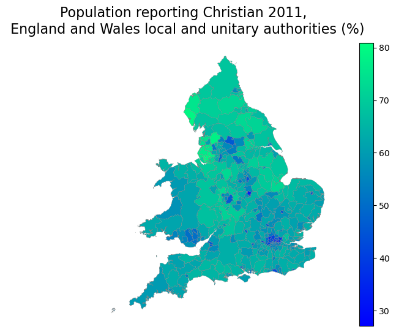
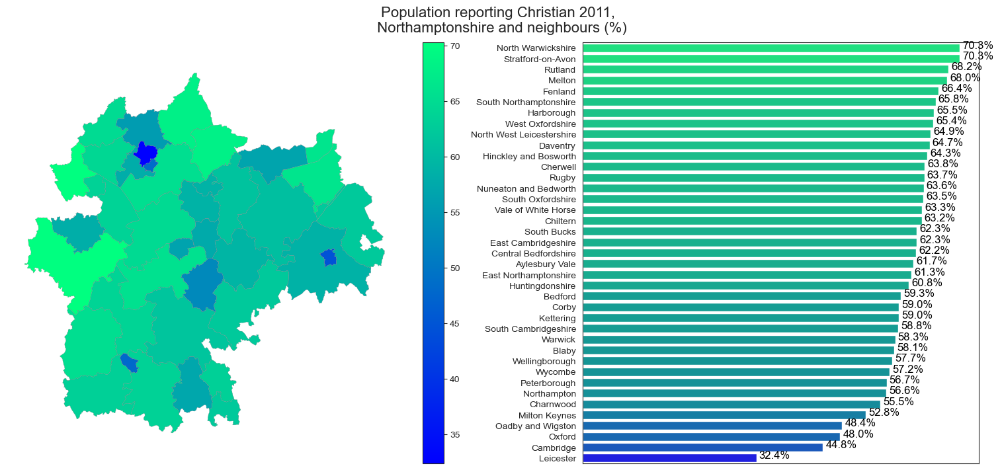

# nomis-visualisation

This project visualizes the UK at district, unitary, or country levels using UK shapefiles from [opendatasoft](https://data.opendatasoft.com/explore/dataset/georef-united-kingdom-county-unitary-authority%40public/map/?disjunctive.ctry_code&disjunctive.ctry_name&disjunctive.rgn_code&disjunctive.rgn_name&disjunctive.ctyua_code&disjunctive.ctyua_name&dataChart=eyJxdWVyaWVzIjpbeyJjb25maWciOnsiZGF0YXNldCI6Imdlb3JlZi11bml0ZWQta2luZ2RvbS1jb3VudHktdW5pdGFyeS1hdXRob3JpdHlAcHVibGljIiwib3B0aW9ucyI6eyJkaXNqdW5jdGl2ZS5jdHJ5X2NvZGUiOnRydWUsImRpc2p1bmN0aXZlLmN0cnlfbmFtZSI6dHJ1ZSwiZGlzanVuY3RpdmUucmduX2NvZGUiOnRydWUsImRpc2p1bmN0aXZlLnJnbl9uYW1lIjp0cnVlLCJkaXNqdW5jdGl2ZS5jdHl1YV9jb2RlIjp0cnVlLCJkaXNqdW5jdGl2ZS5jdHl1YV9uYW1lIjp0cnVlfX0sImNoYXJ0cyI6W3siYWxpZ25Nb250aCI6dHJ1ZSwidHlwZSI6ImxpbmUiLCJmdW5jIjoiQ09VTlQiLCJzY2llbnRpZmljRGlzcGxheSI6dHJ1ZSwiY29sb3IiOiIjMTQyRTdCIn1dLCJ4QXhpcyI6InllYXIiLCJtYXhwb2ludHMiOiIiLCJ0aW1lc2NhbGUiOiJ5ZWFyIiwic29ydCI6IiJ9XSwiZGlzcGxheUxlZ2VuZCI6dHJ1ZSwiYWxpZ25Nb250aCI6dHJ1ZX0%3D&location=5,55.74711,-3.44316&basemap=jawg.streets) 
and UK measurements from [nomisr API](https://cran.r-project.org/web/packages/nomisr/vignettes/introduction.html). 
Extract and manipulate the data and plot UK maps using Python geopandas.

## Prerequisites

For pipeline replication, as an example, only Python installation is needed. All extracted data are available in the [cloud storage directory](https://filedn.com/lK8J7mCaIwsQFcheqaDLG5z/data/ukdata/)

1. **Clone the Repository:** Clone the project repository to your local machine using Git:

    ```batch
    git clone https://github.com/KyriakosJiannis/nomis-visualisation
    ```

2. **Navigate to the Project Directory:** Move to the project directory:

    ```batch
    cd nomis-visualisation
    ```

3. **Activate your virtual environment (recommended):**

    ```batch
    python -m venv venv
    source venv/bin/activate  # On Windows, use: venv\Scripts\activate
    ```

4. **Install the required packages:**

    ```batch
    pip install -r requirements.txt
    ```

5. **Run the Python pipeline script:**

    ```batch
    python ./pipelne/pipeline.py
    ```

## Project Structure

```
root/
├── config/
│   └── config.ini
├── input/
│   └── data.txt
├── notebooks/
│   └── nomis_analysis.ipynb
├── output/
│   │   ├── religions_plot_bar1.png
│   │   └── religions_plot_bar2.png
├── pipeline/
│   ├── __init__.py
│   └── run_pipeline.py
├── src/
│   ├── __init__.py
│   ├── analysis/
│   │   ├── __init__.py
│   │   └── analysis_module.py
│   ├── R_scripts/
│   │   └── get_data_nomis.R
├── utils/
│   └── __init__.py
├── .gitignore
├── LICENSE
├── README.md
└── requirements.txt
```

## Usage

Provide examples and instructions on how to use the `plot_nomis_data` function. 
Include code snippets and explanations for different scenarios with more details in `nomis_analysis.ipynb`.

Example 1: Religion Census UK
```python
plot_nomis_data(
            geo_data=subset_df,
            cmap="winter",
            title="Population reporting Christian 2011, \n England and Wales local and unitary authorities (%)"
)
```

#### Output:
 

Example 2: Sub-selection of Selected Counties
```python
# Sub-selection of selected counties; this example uses Northamptonshire and its neighbors' area
counties = ['Northamptonshire', 'Central Bedfordshire', 'Milton Keynes', 'Bedford', 'Leicestershire', 'Leicester','Rutland', 'Peterborough', 'Cambridgeshire', 'Oxfordshire', 'Buckinghamshire', 'Warwickshire']

plot_nomis_data(
            geo_data=subset_df[subset_df['county'].isin(counties)],
            cmap="winter",
            title="Population reporting Christian 2011, \n Northamptonshire and neighbours (%)",
            barchart="On"
)
```
#### Output:
 

## Development
The next step is to create a web app for religion. Utilise opendatasoft API or/and R (nomisR) and Python pipelines 
for more versatile and comprehensive extractions beyond religions, and perform analysis using both programming languages.

## License
This project is licensed under the MIT License. 
