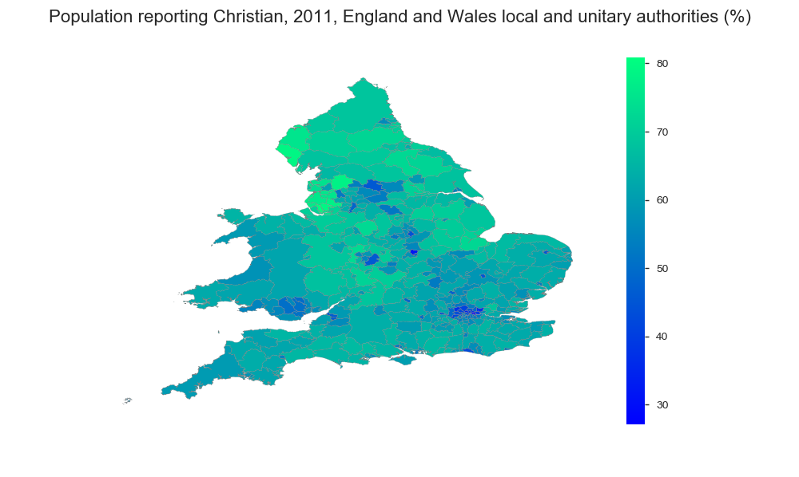
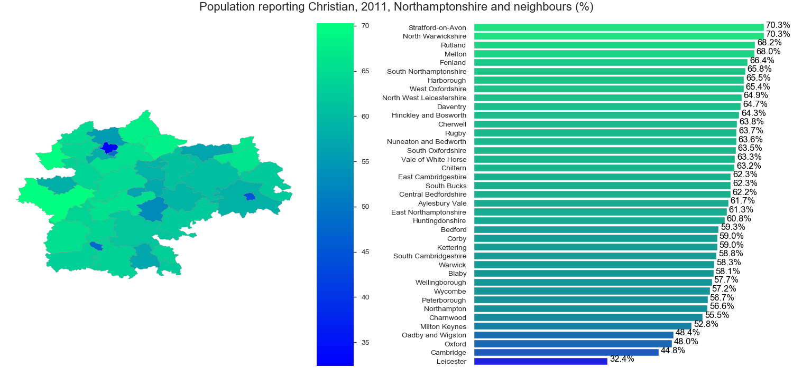

# data-visualisation-GOV-UK
 
Visualise on UK map per district / unitary either coutry, statistical measurements from UK census, labour etc 
Joins <b>shapefile</b> from https://public.opendatasoft.com and uk measurements from <b> nomisr  R API </b>
https://cran.r-project.org/web/packages/nomisr/vignettes/introduction.html and plot on uk map with or without 
barplot. 

* For visualisation uses <b> matplotlib, seaborn, seaborn </b>
* For shapefiles <b> geopandas </b>
* For data validations <b> matplotlib_venn, pandas_profiling </b>
 
<b> plot_nomisr_shapefile </b> :
<br> combines nomisr data, with UK shapefiles and plot statistics on map 


#### Examples for religion census UK:
 
```javascript
plot_nomisr_shapefile(nomisr=df1, #nomisr data with measurements 
                      shapefile=map_df1, #shapefile 
                      shapefilekey='lad18cd', #shapefile key column
                      subset="Christian",  #file subset
                      cmap="winter",  #cmap colours
                      title="Population reporting Christian, 2011, England and Wales local and unitary authorities (%)")
```

#### Output:
 

```javascript
# sub selection specific counties, ie. for Northamptonshire and its neighbours area
counties = ['Northamptonshire',
            'Central Bedfordshire',
            'Milton Keynes',
            'Bedford',
            'Leicestershire',
            'Leicester',
            'Rutland',
            'Peterborough',
            'Cambridgeshire',
            'Oxfordshire',
            'Buckinghamshire',
            'Warwickshire']

plot_nomisr_shapefile(nomisr=df1[df1['GEOGRAPHY_CODE'].isin(map_df1['lad18cd'][map_df1['county'].isin(counties)])],
                      shapefile=map_df1,
                      shapefilekey='lad18cd',
                      subset="Christian",
                      cmap="winter",
                      title="Population reporting Christian, 2011, Northamptonshire and neighbours (%)",
                      barchart="On")
```
#### Output:
 
 